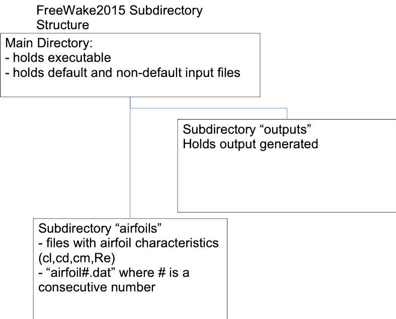
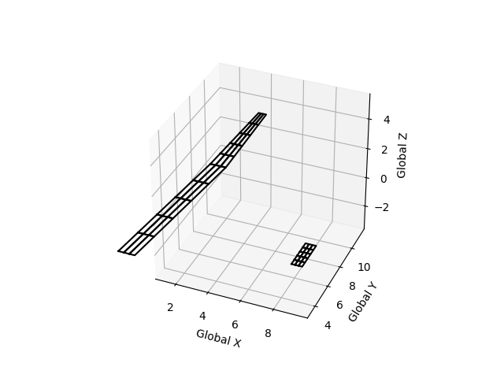

# A Quick Guide to FreeWake2018 beta

> A more detailed description of the underlying theoretical model with validation and sample applications is listed in:  
> **“A Higher Order Vortex-Lattice Method with a Force-Free Wake,”** by Götz Bramesfeld, Dissertation, Pennsylvania State University, August 2006.

FreeWake2018 beta is a modification of FreeWake2007/2008.

The program computes the inviscid loads of up to five wings (maybe more). It uses two wake models:
1. A prescribed wake model based on Horstmann’s multiple lifting line method.
2. A relaxed, force-free wake model.

Either model has lifting lines with a spanwise circulation distribution of the shape of a second-order spline.

---

## Table of Contents
- [How to compile](#how-to-compile)
- [Directory Structure](#directory-structure)
- [Inputs](#inputs)
  - [Input Files](#input-files)
  - [Input.txt File](#inputtxt-file)
    - [Panel Boundary Conditions](#panel-boundary-conditions)
    - [Sample Input File](#sample-input-file)
  - [Airfoil File](#airfoil-file)
    - [Sample Airfoil File](#sample-airfoil-file)
- [Output](#output)

---

## How to compile

```bash
g++ Source/Main_PerfCode2018.cpp -o fw
```

The executable is `fw`.

---

## Directory Structure

FreeWake requires several subdirectories in order to run properly. The input directories (`inputs` and `airfoils`) have to be created by the user before running.

- **Subdirectory `output/`**: Holds output generated by the simulation.

  
*Figure 1: Subdirectory structure of FreeWake2018 beta.*

---

## Inputs

The default input file is a text file named `input.txt` located in the same directory as the executable. Output is written to `output/`.

A non-default input file can be used (e.g., `WingC.txt`) by calling the program with the executable followed by the root of the input file name:
```bash
./fw WingC
```
The program will create the output subdirectory that matches the root of the non-default input file name (e.g., `output/Wing/`).

### Input Files

The lifting surface geometry and flow conditions are defined in the input file.

- **Airfoil files**: Hold aerodynamic section characteristics of different airfoils (AoA, cl, cd, Re, cm). Files reside in the `airfoils/` subdirectory and are named `airfoil#.dat`, where `#` is a consecutive integer starting at 1. Airfoil files are only needed if `viscous = 1` in the input file. *(Note: the viscous model might be out of order as of Jan. 2021).*
- **Special Identifiers**: The following characters serve as identifiers in input files and must be used carefully:
  - `=`
  - `:`
  - `#`  
  Any further spaces or comments are ignored by the parser.

### Input.txt File

- Holds configuration and general simulation information.
- Must be located in the working directory of the executable.
- The sample input file models the wing and horizontal-tail configuration shown in Figure 2. Note that only the right-wing halves are defined when the symmetry flag is enabled (`sym = 1`).

  
*Figure 2: Right half of wing-tail configuration of the sample input file.*

- **Coordinate System**: Positive x in the wind direction (downstream), positive y along the right wing (starboard), and positive z upwards.
- **Leading Edge Lines**: Defined for the left and right panel edges (looking in the direction of flight), along with the chord and incidence angle (positive epsilon = pitch up) of the respective edges. Twist can be introduced by specifying different epsilon values on either side of a panel, or by using different camber lines at the left and right edge.
- **Flat-Plate Wing Model**: The wing is modeled as a flat plate; geometric twist is incorporated via incidence angles (epsilon). Therefore, epsilon should align the panel with the zero-lift line of that particular wing section.

#### Panel Boundary Conditions

`Bound.Cond.` defines the boundary condition at the respective edge of the panel:
- **`100`**: Wingtip / free end (zero circulation, unknown vorticity strength and derivative thereof: Gamma = 0).
- **`220`**: Panel-to-panel junction (two or more neighboring elements: equal circulation and vorticity, Gamma_i = Gamma_j and Gamma'_i = Gamma'_j).
- **`010`** (or **`10`**): Symmetry plane / centerline case (unknown circulation, zero vorticity slope: Gamma' = 0).

---

#### Sample Input File

Below is the annotated sample input file (`input.txt`):

```text
Input file for FreeWake 2014
Format will not work with older versions
Input file generated by Travis's m-file, in m/N/sec
Please note that the program uses equal, number and : signs as special recognizers!
The results are written to the sub-directory output'

Simulation parameters
Relaxed wake (yes 1, no 0):				relax	=	0	choice of wake model
Steady (1) or unsteady (2):		aerodynamics 	=	1	=2 Quasi unsteady I (no apparent mass)
Viscous solutions (1) or inviscid (0)	viscous	=   1	=1 includes profile drag ; =0 inviscid
Symmetrical geometry (yes 1, no 0):		sym 	=	1	1 only right wing is modeled
Longitudinal trim (yes 1, no 0):		trim 	=	0	(yes means m has to be 1)

Max. number of time steps:	maxtime = 20 	number of timesteps
Width of each time step (sec):	deltime = 0.25 	Defines timestep size (with Uinf)
Convergence delta-span effic.:	deltae = 0.0	(0 if only timestepping) convergence criteria

freestream flow condition
Freestream velocity (leave value 1):	Uinf 	=	1.0
AOA beginning, end, step size [deg]:	alpha	=	5.0 25.0 2.0 	alpha sweep: 5 to 25 deg every 2 deg
Sideslip angle [deg]:					beta 	=	0.0
Density:								density =	1.
Kinematic viscosity:					nu 		=	1.450000e-05

Reference area:			S =	25.0
Reference span:			b =	30.0
Mean aerodynamic chord:		cmac =	0.0
Aircraft weight (N):		W =	200.
CG location (x y z):		cg =	0 0 0 	cg location (x,y,z) for trim
CMo of wing:				CMo =	-0.1 	initial pitching moment coefficient, for trim

No. of wings (max. 5):		wings 	=	2 	a t-tail is a single wing
No. of panels:				panels 	=	3 	total number of panels. Several panels define a wing
No. of chordwise lifting lines: 	m =	3 	number of lifting lines across the chord, same for all panels
No. of airfoils (max. 15):	airfoils =	8 	defines how many airfoil files need to be provided

general review of some parameters
Panel boundary conditions:
	Symmetry line - 	10
	Between panels - 	220
	Free end - 		100

Defines leading edge of wing, all measured in metres:
Definition of panels that describe the geometry. Each panel has nxm DVEs in the spanswise and chordwise direction, respectively. Each panel can have unique n values. If neighboring panels have different m-values, this may result in discontinuous circulation distribution. “overhanging” lifting lines are treated like wingtips (BC =100). Airfoil defines airfoil that is used over this panel.

First panel, panel 1 of right wing, starts here:
Panel #:1. Number of elements across span n = 5 
Neighbouring panels (0 for none) left: 0 right: 2 	panel at the right and left of panel. 0 for wingtip.
xleft	yleft	zleft	chord	epsilon	Bound.Cond. Airfoil
0.0	0	0.00	1.00	0.00	010		2 
# x,y,z chord, incidence angle, boundary condition (symmetry) airfoil at left edge
xright	yright	zright	chord	epsilon	Bound.Cond. Airfoil
1.0	0	0.000   1.      0.000	220		3
# x,y,z chord, incidence angle, bound. cond. (neighboring element) airfoil on right edge

Panel #:2. Number of elements across span n = 5 
Neighbouring panels (0 for none) left: 1 right: 0
xleft	yleft	zleft	chord	epsilon	Bound.Cond. Airfoil
1.0	10	0.000   1.      0.000	220		3
xright	yright	zright	chord	epsilon	Bound.Cond. Airfoil
2.0	15	2.000   0.5     0.000	100		3
# x,y,z chord, incidence angle, bound. cond. (wingtip), airfoil

Right side of horizontal tail, only one panel
Panel #:3. Number of elements across span n = 5 
Neighbouring panels (0 for none) left: 3 right: 0
xleft	yleft	zleft	chord	epsilon	Bound.Cond. Airfoil
10.15	.00	2.00	0.600	.00		010	3	
xright	yright	zright	chord	epsilon	Bound.Cond. Airfoil
10.15	2.00	2.00	0.600	.00		100	3

Vertical tail is as nonlifting surface modelled, that is drag = 1/2 rho*V^2*S_tail*cd_profile(alpha=0)
Airfoil 5 is presumably a symmetrical airfoil
%<- special identifier
Vertical tail information:
Number of panels (max 5) = 2
no.	chord	area	airfoil
1	  1.2	5
1.5	  2.2	5

The fuselage drag is estimated based on its washed surface area and using laminar or turbulent drag coefficients of a flat plate at zero angle of attack. Surface area of each section is estimated based on its diameter and length.
Fuselage information: 
no. of sections (max 20) = 9  width of each section = .8
index of panel where transition to turbulent flow occurs = 4
no.	Diameter 
1	.42
2	.68
3	.84
4	.86
5	.64
6	.48
7	.40
8	.32
9	.24 

Interference for total drag
Interference drag = 1.0%
##############
END OF SAMPLE INPUT FILE
```

---

### Airfoil File

- Required when viscous flow solutions are requested (`viscous = 1`).
- Holds aerodynamic section polar characteristics: `alpha`, `cl`, `cd`, `Re`, `cm`.
- File naming convention: `airfoils/airfoil#.dat`, where `#` is a consecutive integer starting at 1.
- If camber line modeling is enabled (`camber = 1`), the number in the airfoil name corresponds to the respective camber file.
- Airfoil changes across a panel are supported via linear interpolation between the left and right edges.
- **Data formatting**:
  - First line is a comment line describing the airfoil and specifying the total row count (e.g. `Number of Rows = 374`).
  - Five tab/space-separated columns:
    1. Angle of attack alpha [deg]
    2. Section lift coefficient cl
    3. Section drag coefficient cd
    4. Chord Reynolds number Re
    5. Section pitching moment coefficient cm
  - Grouped by ascending Reynolds numbers.
  - Within each Reynolds number block, data must be sorted by strictly increasing cl (pre-stall only; no post-stall reversal).
  - The solver performs linear interpolation between data points.
  - Polar data can be generated using XFOIL, experimental wind tunnel tests, or CFD.

#### Sample Airfoil File

```text
FX 67-K-170/17     0 degrees Flap    Number of Rows =374 	Number of rows of data
-5	0.0084	0.01632	5.00E+05	-0.107
-4.8	0.028	0.01571	5.00E+05	-0.1067
-4.6	0.0476	0.01518	5.00E+05	-0.1064
.
.
.
.
8.2	1.3708	0.01158	5.00E+05	-0.104
8.4	1.3776	0.01174	5.00E+05	-0.1016
8.6	1.3779	0.01215	5.00E+05	-0.0983 	Next Reynolds number
-5	0.0097	0.01398	7.00E+05	-0.1065
-4.8	0.0293	0.01344	7.00E+05	-0.1062
-4.6	0.0491	0.01299	7.00E+05	-0.1059
.
.
.
7.8	1.3455	0.00982	7.00E+05	-0.1061
8	1.3502	0.00996	7.00E+05	-0.103
8.25	1.3515	0.01024	7.00E+05	-0.0984 	Next Reynolds number
-5	0.0086	0.01222	1.00E+06	-0.1059
-4.8	0.0286	0.01179	1.00E+06	-0.1056
-4.6	0.0489	0.0114		1.00E+06	-0.1055
.
.
.
7	1.3039	0.00828	1.00E+06	-0.1141
7.2	1.3195	0.00843	1.00E+06	-0.1132
7.4	1.3343	0.00855	1.00E+06	-0.1121
7.8	1.3499	0.00904	1.00E+06	-0.1073 	Next Reynolds number
-5	0.0002	0.00781	4.00E+06	-0.1044
-4.8	0.0224	0.0077		4.00E+06	-0.1046
.
.
.
6	1.2294	0.00591	4.00E+06	-0.1202
6.2	1.2404	0.00636	4.00E+06	-0.1185
6.4	1.2463	0.00695	4.00E+06	-0.1158
6.6	1.2465	0.00762	4.00E+06	-0.112
END OF SAMPLE AIRFOIL FILE
```

---

## Output

Several output files are generated and written to the designated output directory (default: `output/`):

- **`Performance.txt`**: Holds a summary of the angle-of-attack (alpha) sweep, including lift, induced drag, profile drag, tail drag, fuselage drag, interference drag, and pitching moment results.
- **`TrimSol.txt`**: Records longitudinal trim iteration convergence results.
- **`AOA##.txt`**: Lifting surface aerodynamic loads and spanwise circulation distribution for each evaluated angle of attack (`##`).
- **`timestep##.txt`**: Complete flow-field solution including geometry and strengths of all surface Distributed-Vorticity Elements (DVE) and wake DVEs at timestep `##`.

### DVE Output Header Definitions

The flow field and geometry output files contain the following geometric and aerodynamic parameters:

| Variable | Description |
| :--- | :--- |
| **Chord** | Mid-span chord length of the element ($c = 2\xi$) |
| **eta** ($\eta$) | Half-span of the Distributed-Vorticity Element |
| **xsi** ($\xi$) | Half-chord of the Distributed-Vorticity Element |
| **phi** ($\phi$) | Sweep angle of the element bound vortex / mid-chord line |
| **nu** ($\nu$) | Dihedral angle of the element |
| **epsilon** ($\varepsilon$) | Incidence (pitch) angle of the element |
| **psi** ($\psi$) | Yaw angle of the element |
